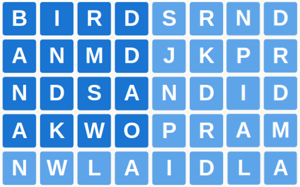

# Fourplay game

## Overview

When Svelte 3.0 was released in 2019 I came up with Fourplay in order to give it a try. At the same time I wanted to try out [Actix](https://actix.rs/), and the [actor model](https://en.wikipedia.org/wiki/Actor_model). Four years later, with a mind mostly wiped of the experience, I figure it's time to share it.

In looking over the code, I find myself both surprised and ashamed. Surprised that I had the patience to create the over-engineered backend that I did, and ashamed by the mess of code that both the front and back are.

The game itself is a four player cooperative puzzle game which has daily puzzles. I wanted to build something cooperative as opposed to directly competitve, since so much out there is just that. I mean directly competitive, since you're still competing with other teams, it's just that in your individual game you should be working with other players to increase your overall score.

The game takes place on an 8x8 grid and you're assigned a 4x4 chunk of it:



You create new words by swapping adjacent words both horizontally and vertically.


Points are calculated for words three letters and longer, with the amount doubling for each extra letter, which makes cooperating with teammates necessary in order to score well.

## Getting it to run

### Docker

The easiest way to run this is with Docker. Clone the repo and

```bash
git clone https://github.com/kilroyjones/fourplay
cd fourplay
docker-compose up --build
```

This will take a bit the first time as Docker downloads the images and the backend compiles.

### Without Docker

You can also run it without Docker. Starting with the server you will need to [install rust](https://doc.rust-lang.org/book/ch01-01-installation.html). Once installed check that cargo is working at the command line:

```bash
cargo version
```

Clone this repo, go to the server folder, and run:

```bash
git clone https://github.com/kilroyjones/fourplay
cd fourplay/server
cargo build --release
```

This might take awhile the first time as the initial packages install, but after that it should be relatively quick if any changes to the code are made.

Once that is finished, you'll want to create a **.env** file or rename the existing "template.env", which sets the environment variables and enter the following:

```bash
RUST_LOG=debug
DATABASE_URL=sqlite://game.db
```

You can also set **RUST_LOG** to info or error, depending on how much you want to see.

At the moment the server is bound to **0.0.0.0** to get it play well with Docker. You can change this to localhost inside the **server/src/main.rs** file/.

```rust
    .bind("0.0.0.0:3080")?
    .run()
    .await
```

We need to set up the database, so you'll want to run the **reset_db.sh** script, which will take care of that for you as long as you've build the release version. If you did a straight **cargo build**, then you can change the path in **reset_db.sh** to reflect that.

Run the reset script:

```bash
./reset_db.sh
```

Next, we need the frontend, so navigate to the **client** folder, and assuming you have Node and NPM installed, run the following:

```bash
npm install
npm run dev
```

This starts you in development mode and the game should work without difficulty by navigating to **http://localhost:8080** in your browser. If you'd like to change this address you can that do in **client/src/main.js** and adjust the **connectionUrl** as you'd like. At this point you should have the front and back ends running and you can open multiple tabs to simulate playing with multiple players.

### Licenese

Copyright 2023 Thomas Bach

Licensed under the Apache License, Version 2.0 (the "License");
you may not use this file except in compliance with the License.
You may obtain a copy of the License at

http://www.apache.org/licenses/LICENSE-2.0

Unless required by applicable law or agreed to in writing, software
distributed under the License is distributed on an "AS IS" BASIS,
WITHOUT WARRANTIES OR CONDITIONS OF ANY KIND, either express or implied.
See the License for the specific language governing permissions and
limitations under the License.
